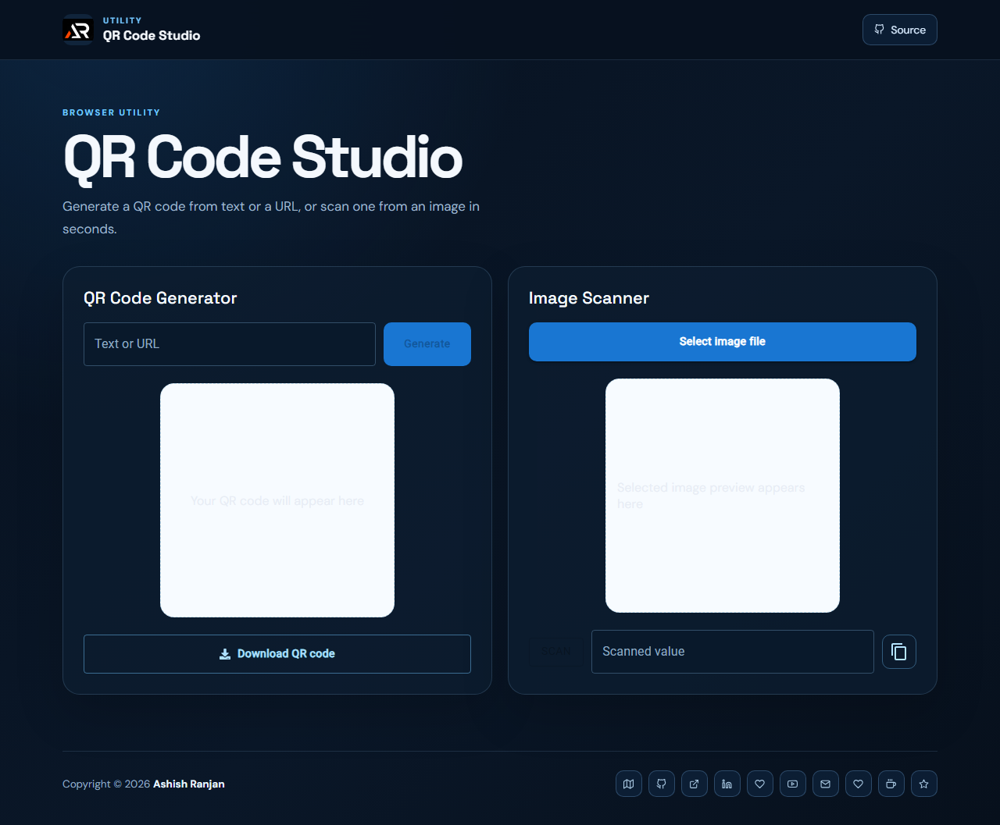

# QR Code Studio

A responsive React utility for generating QR codes from text or URLs and scanning QR values from uploaded images.

## Features

- Generate and download QR code images.
- Scan QR codes from local image files in the browser.
- Copy scanned values with clear feedback.
- Responsive layout with accessible controls.

## Tech stack

React, Create React App, Material UI, Sass, React Icons, Axios, and QR Scanner.

## Run locally

```bash
npm install
npm start
```

## Deployment

Live app: [https://a2rp.github.io/qrcode-generator-scanner/](https://a2rp.github.io/qrcode-generator-scanner/)

```bash
npm run build
npm run deploy
```



## Links

- Portfolio: [https://www.ashishranjan.net/](https://www.ashishranjan.net/)
- GitHub: [https://github.com/a2rp](https://github.com/a2rp)
- CodePen: [https://codepen.io/ash1198](https://codepen.io/ash1198)
- LinkedIn: [https://www.linkedin.com/in/aashishranjan](https://www.linkedin.com/in/aashishranjan)
- Facebook: [https://www.facebook.com/theash.ashish/](https://www.facebook.com/theash.ashish/)
- YouTube: [https://www.youtube.com/@ashishranjan-ashz?sub_confirmation=1](https://www.youtube.com/@ashishranjan-ashz?sub_confirmation=1)
- Email: [ash.ranjan09@gmail.com](mailto:ash.ranjan09@gmail.com)

## Support

- Support: [https://a2rp-donation-page.netlify.app/](https://a2rp-donation-page.netlify.app/)
- Buy Me a Coffee: [https://buymeacoffee.com/a2rp](https://buymeacoffee.com/a2rp)
- Patreon: [https://patreon.com/a2rp](https://patreon.com/a2rp)
